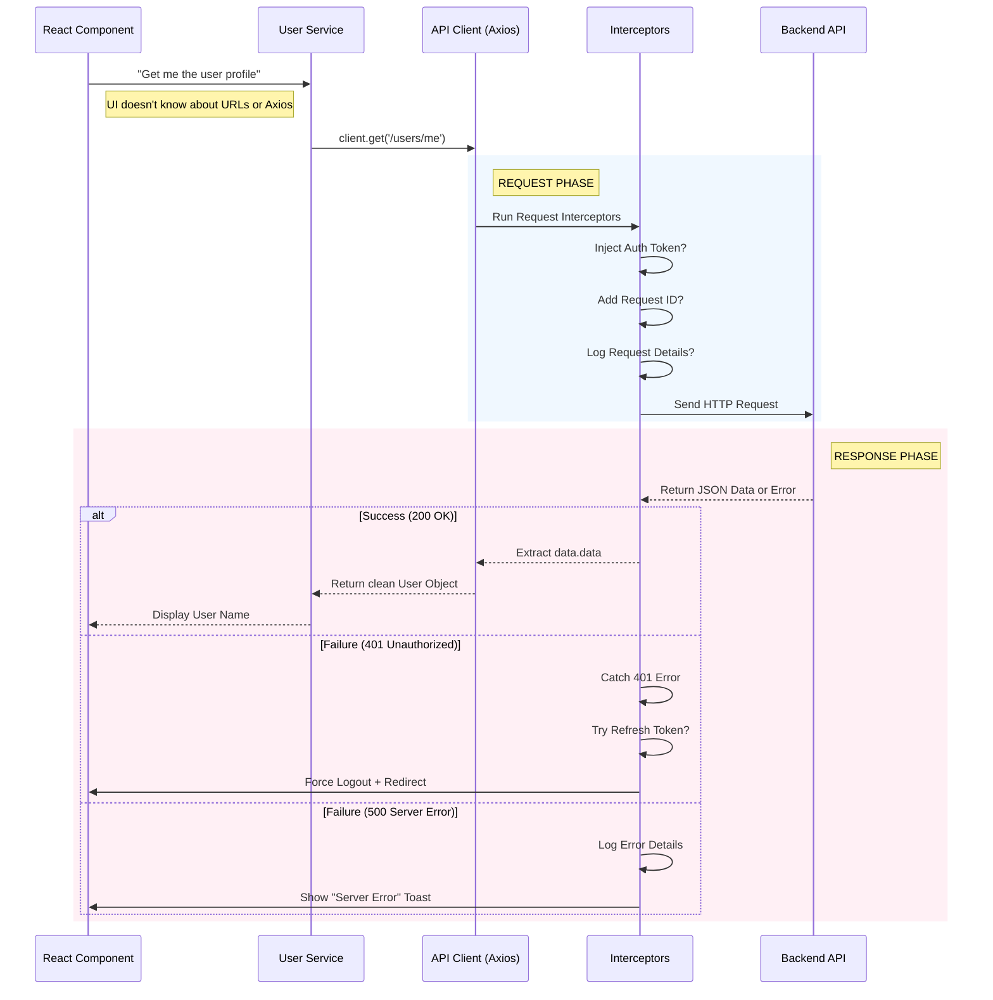

# The Axios API Client Architecture
## From Zero to Professional Scale

> **Context**: You mentioned you only know `axios.get`. That is the "Command Line" approach. We are going to build an **Enterprise Factory**.

---

## 1. The Visual Architecture

### The Restaurant Analogy

Imagine your app is a restaurant with different roles:

| Role | Real System | Responsibility |
|------|-------------|----------------|
| **Customers** | Components (UI) | Order food (request data) |
| **Waiters** | Service Layer | Know the menu (endpoints) and take orders |
| **Kitchen Manager** | API Client (Axios Instance) | Ensure every dish is cooked correctly (headers), reject bad orders (error handling), manage flow |
| **Quality Control** | Interceptors | Add garnish & taste-test every plate |

### Interceptors Breakdown

**Request Interceptor**: The Prep Station
- Adds garnish (Auth Token) to every plate before it leaves
- Adds tracking IDs, timestamps, or custom headers
- Logs outgoing requests for debugging

**Response Interceptor**: The Tasting Station
- Tastes the food before serving
- If it's burnt (Error 500), throw it out and apologize
- If it needs salt (Refresh Token), fix it automatically
- Unwraps the data so customers get clean plates

---

## 2. The Flow Diagram



### Flow Explanation

1. **Component Layer**: The UI requests data without knowing implementation details
2. **Service Layer**: Acts as an abstraction - maps business logic to API endpoints
3. **API Client**: The configured Axios instance with baseURL and interceptors
4. **Request Interceptor Chain**: Runs before every request hits the server
5. **Response Interceptor Chain**: Runs after every response arrives
6. **Error Recovery**: Handles token refresh, retry logic, and global error states

---

## 3. The Golden Rules of Scalability

### Rule #1: The Singleton Rule
**Never import axios directly in a component. Create one instance and reuse it.**

```javascript
// ❌ BAD - Creates new instance every time
import axios from 'axios';
const response = await axios.get('http://localhost:5000/api/users');

// ✅ GOOD - Reuses configured instance
import apiClient from './api-client';
const response = await apiClient.get('/users');
```

**Why?** 
- Prevents duplicate configuration
- Interceptors apply to all requests
- Centralized baseURL management

---

### Rule #2: The Interceptor Rule
**Never manually add Authorization headers in a component. The interceptor does it globally.**

```javascript
// ❌ BAD - Repeating auth logic everywhere
const token = localStorage.getItem('token');
const response = await axios.get('/users', {
  headers: { Authorization: `Bearer ${token}` }
});

// ✅ GOOD - Interceptor handles it
const response = await apiClient.get('/users');
// Token is automatically injected
```

**Why?**
- DRY (Don't Repeat Yourself)
- Token refresh logic in one place
- Easy to update auth strategy globally

---

### Rule #3: The Unwrapping Rule
**Axios returns nested objects. Your UI only cares about the data. Unwrap in the client layer.**

```javascript
// ❌ BAD - UI deals with axios structure
const response = await apiClient.get('/users');
const users = response.data.data; // Nested access

// ✅ GOOD - Interceptor unwraps automatically
const users = await apiClient.get('/users');
// Response interceptor returns response.data.data directly
```

**Why?**
- Cleaner component code
- Consistent data structure
- Easier to mock for testing

---

### Rule #4: The Central Error Rule
**Don't write try/catch for 401 errors in every component. Handle it in one place.**

```javascript
// ❌ BAD - Scattered error handling
try {
  const data = await apiClient.get('/users');
} catch (error) {
  if (error.response?.status === 401) {
    logout();
    navigate('/login');
  }
}

// ✅ GOOD - Interceptor handles globally
const data = await apiClient.get('/users');
// 401 errors trigger automatic logout via interceptor
```

**Why?**
- Single source of truth for auth errors
- Prevents inconsistent behavior
- Reduces component complexity

---

## 4. Implementation Strategy

### File Structure

```
src/
├── api/
│   ├── client/
│   │   ├── api-client.js          # Core Axios instance
│   │   ├── interceptors.js        # Request/Response interceptors
│   │   └── config.js              # Environment-based config
│   ├── services/
│   │   ├── auth.service.js        # Authentication APIs
│   │   ├── user.service.js        # User management APIs
│   │   ├── message.service.js     # Messaging APIs
│   │   └── file.service.js        # File upload APIs
│   └── index.js                   # Central export point
```

---

## 5. Code Implementation

### A. The Core (api-client.js)

This file creates the Axios instance with baseURL and attaches interceptors.

```javascript
// src/api/client/api-client.js
import axios from 'axios';
import { requestInterceptor, responseInterceptor, errorInterceptor } from './interceptors';

// Base configuration
const apiClient = axios.create({
  baseURL: import.meta.env.VITE_API_BASE_URL || 'http://localhost:5000/api',
  timeout: 15000, // 15 seconds
  headers: {
    'Content-Type': 'application/json',
  },
});

// Attach request interceptor
apiClient.interceptors.request.use(
  requestInterceptor,
  (error) => Promise.reject(error)
);

// Attach response interceptor
apiClient.interceptors.response.use(
  responseInterceptor,
  errorInterceptor
);

export default apiClient;
```

---

### B. The Interceptors (interceptors.js)

```javascript
// src/api/client/interceptors.js

// ============================================
// REQUEST INTERCEPTOR
// ============================================
export const requestInterceptor = (config) => {
  // 1. Inject Authentication Token
  const token = localStorage.getItem('accessToken');
  if (token) {
    config.headers.Authorization = `Bearer ${token}`;
  }

  // 2. Add Request ID for tracking
  config.headers['X-Request-ID'] = crypto.randomUUID();

  // 3. Log outgoing requests (development only)
  if (import.meta.env.DEV) {
    console.log('🚀 API Request:', {
      method: config.method.toUpperCase(),
      url: config.url,
      data: config.data,
    });
  }

  return config;
};

// ============================================
// RESPONSE INTERCEPTOR (Success)
// ============================================
export const responseInterceptor = (response) => {
  // Unwrap the data layer
  // Axios returns: { data: { data: actualData, message: "Success" }, status: 200 }
  // We want: actualData

  if (import.meta.env.DEV) {
    console.log('✅ API Response:', response.data);
  }

  // Return the inner data object
  return response.data.data || response.data;
};

// ============================================
// ERROR INTERCEPTOR
// ============================================
let isRefreshing = false;
let failedQueue = [];

const processQueue = (error, token = null) => {
  failedQueue.forEach((prom) => {
    if (error) {
      prom.reject(error);
    } else {
      prom.resolve(token);
    }
  });
  failedQueue = [];
};

export const errorInterceptor = async (error) => {
  const originalRequest = error.config;

  // Log errors in development
  if (import.meta.env.DEV) {
    console.error('❌ API Error:', {
      url: error.config?.url,
      status: error.response?.status,
      message: error.response?.data?.message,
    });
  }

  // ============================================
  // Handle 401 Unauthorized (Token Expired)
  // ============================================
  if (error.response?.status === 401 && !originalRequest._retry) {
    if (isRefreshing) {
      // Queue requests while refreshing token
      return new Promise((resolve, reject) => {
        failedQueue.push({ resolve, reject });
      })
        .then((token) => {
          originalRequest.headers.Authorization = `Bearer ${token}`;
          return axios(originalRequest);
        })
        .catch((err) => Promise.reject(err));
    }

    originalRequest._retry = true;
    isRefreshing = true;

    try {
      // Attempt to refresh token
      const refreshToken = localStorage.getItem('refreshToken');
      const { data } = await axios.post(
        `${import.meta.env.VITE_API_BASE_URL}/auth/refresh`,
        { refreshToken }
      );

      const newAccessToken = data.data.accessToken;
      localStorage.setItem('accessToken', newAccessToken);

      // Process queued requests
      processQueue(null, newAccessToken);

      // Retry original request
      originalRequest.headers.Authorization = `Bearer ${newAccessToken}`;
      return axios(originalRequest);
    } catch (refreshError) {
      // Refresh failed - force logout
      processQueue(refreshError, null);
      localStorage.clear();
      window.location.href = '/login';
      return Promise.reject(refreshError);
    } finally {
      isRefreshing = false;
    }
  }

  // ============================================
  // Handle 403 Forbidden
  // ============================================
  if (error.response?.status === 403) {
    // User doesn't have permission
    window.dispatchEvent(new CustomEvent('show-toast', {
      detail: { 
        message: 'You do not have permission to perform this action',
        type: 'error' 
      }
    }));
  }

  // ============================================
  // Handle 500 Server Errors
  // ============================================
  if (error.response?.status >= 500) {
    window.dispatchEvent(new CustomEvent('show-toast', {
      detail: { 
        message: 'Server error. Please try again later.',
        type: 'error' 
      }
    }));
  }

  // Return structured error
  return Promise.reject({
    status: error.response?.status,
    message: error.response?.data?.message || 'An error occurred',
    data: error.response?.data,
  });
};
```

---

### C. Service Layer (auth.service.js)

Group related API calls by feature. Each service exposes clean methods.

```javascript
// src/api/services/auth.service.js
import apiClient from '../client/api-client';

class AuthService {
  /**
   * User Registration
   * @param {Object} userData - { name, email, password }
   * @returns {Promise<Object>} User object
   */
  async register(userData) {
    return apiClient.post('/auth/register', userData);
  }

  /**
   * User Login
   * @param {Object} credentials - { email, password }
   * @returns {Promise<Object>} { user, accessToken, refreshToken }
   */
  async login(credentials) {
    const data = await apiClient.post('/auth/login', credentials);

    // Store tokens
    localStorage.setItem('accessToken', data.accessToken);
    localStorage.setItem('refreshToken', data.refreshToken);

    return data.user;
  }

  /**
   * User Logout
   */
  async logout() {
    try {
      await apiClient.post('/auth/logout');
    } finally {
      localStorage.clear();
      window.location.href = '/login';
    }
  }

  /**
   * Get Current User Profile
   * @returns {Promise<Object>} User object
   */
  async getProfile() {
    return apiClient.get('/auth/me');
  }

  /**
   * Update User Profile
   * @param {Object} updates - { name, avatar, etc. }
   */
  async updateProfile(updates) {
    return apiClient.patch('/auth/me', updates);
  }

  /**
   * Change Password
   * @param {Object} passwords - { currentPassword, newPassword }
   */
  async changePassword(passwords) {
    return apiClient.post('/auth/change-password', passwords);
  }
}

export default new AuthService();
```

---

### D. Additional Services

```javascript
// src/api/services/user.service.js
import apiClient from '../client/api-client';

class UserService {
  async searchUsers(query) {
    return apiClient.get('/users/search', { params: { q: query } });
  }

  async getUserById(userId) {
    return apiClient.get(`/users/${userId}`);
  }

  async updateUserStatus(status) {
    return apiClient.patch('/users/status', { status });
  }
}

export default new UserService();
```

```javascript
// src/api/services/message.service.js
import apiClient from '../client/api-client';

class MessageService {
  async getMessages(chatId, page = 1, limit = 50) {
    return apiClient.get(`/messages/${chatId}`, {
      params: { page, limit }
    });
  }

  async sendMessage(chatId, content, type = 'text') {
    return apiClient.post('/messages', { chatId, content, type });
  }

  async deleteMessage(messageId) {
    return apiClient.delete(`/messages/${messageId}`);
  }

  async markAsRead(messageIds) {
    return apiClient.patch('/messages/read', { messageIds });
  }
}

export default new MessageService();
```

---

### E. Central Export (index.js)

```javascript
// src/api/index.js
export { default as apiClient } from './client/api-client';
export { default as AuthService } from './services/auth.service';
export { default as UserService } from './services/user.service';
export { default as MessageService } from './services/message.service';
export { default as FileService } from './services/file.service';
```

---

## 6. Usage in Components

### Example: Login Component

```javascript
// src/components/Auth/LoginForm.jsx
import { useState } from 'react';
import { AuthService } from '@/api';
import { useNavigate } from 'react-router-dom';

export default function LoginForm() {
  const [email, setEmail] = useState('');
  const [password, setPassword] = useState('');
  const [loading, setLoading] = useState(false);
  const navigate = useNavigate();

  const handleLogin = async (e) => {
    e.preventDefault();
    setLoading(true);

    try {
      // Clean service call - no axios details leaked
      const user = await AuthService.login({ email, password });

      console.log('Logged in as:', user.name);
      navigate('/dashboard');
    } catch (error) {
      // Error is already structured by interceptor
      alert(error.message);
    } finally {
      setLoading(false);
    }
  };

  return (
    <form onSubmit={handleLogin}>
      <input 
        type="email" 
        value={email} 
        onChange={(e) => setEmail(e.target.value)}
        placeholder="Email"
      />
      <input 
        type="password" 
        value={password} 
        onChange={(e) => setPassword(e.target.value)}
        placeholder="Password"
      />
      <button type="submit" disabled={loading}>
        {loading ? 'Logging in...' : 'Login'}
      </button>
    </form>
  );
}
```

---

### Example: User Profile Component

```javascript
// src/components/Profile/UserProfile.jsx
import { useEffect, useState } from 'react';
import { AuthService } from '@/api';

export default function UserProfile() {
  const [user, setUser] = useState(null);
  const [loading, setLoading] = useState(true);

  useEffect(() => {
    loadProfile();
  }, []);

  const loadProfile = async () => {
    try {
      const userData = await AuthService.getProfile();
      setUser(userData);
    } catch (error) {
      console.error('Failed to load profile:', error);
    } finally {
      setLoading(false);
    }
  };

  const handleUpdateProfile = async (updates) => {
    try {
      const updatedUser = await AuthService.updateProfile(updates);
      setUser(updatedUser);
    } catch (error) {
      alert(error.message);
    }
  };

  if (loading) return <div>Loading...</div>;

  return (
    <div>
      <h1>{user.name}</h1>
      <p>{user.email}</p>
      {/* Update form */}
    </div>
  );
}
```

---

## 7. Advanced Patterns

### A. Request Cancellation

```javascript
// src/api/services/search.service.js
import apiClient from '../client/api-client';

class SearchService {
  cancelToken = null;

  async search(query) {
    // Cancel previous request if still pending
    if (this.cancelToken) {
      this.cancelToken.cancel('New search initiated');
    }

    // Create new cancel token
    this.cancelToken = axios.CancelToken.source();

    try {
      return await apiClient.get('/search', {
        params: { q: query },
        cancelToken: this.cancelToken.token,
      });
    } catch (error) {
      if (axios.isCancel(error)) {
        console.log('Request cancelled:', error.message);
      }
      throw error;
    }
  }
}

export default new SearchService();
```

---

### B. File Upload with Progress

```javascript
// src/api/services/file.service.js
import apiClient from '../client/api-client';

class FileService {
  async uploadFile(file, onProgress) {
    const formData = new FormData();
    formData.append('file', file);

    return apiClient.post('/files/upload', formData, {
      headers: {
        'Content-Type': 'multipart/form-data',
      },
      onUploadProgress: (progressEvent) => {
        const percentCompleted = Math.round(
          (progressEvent.loaded * 100) / progressEvent.total
        );
        onProgress?.(percentCompleted);
      },
    });
  }

  async uploadMultiple(files, onProgress) {
    const formData = new FormData();
    files.forEach((file) => formData.append('files', file));

    return apiClient.post('/files/upload-multiple', formData, {
      headers: { 'Content-Type': 'multipart/form-data' },
      onUploadProgress: (e) => {
        onProgress?.(Math.round((e.loaded * 100) / e.total));
      },
    });
  }
}

export default new FileService();
```

---

### C. Retry Logic for Network Failures

```javascript
// src/api/client/interceptors.js (enhanced)

export const errorInterceptor = async (error) => {
  const originalRequest = error.config;

  // Retry on network errors (not 4xx/5xx)
  if (!error.response && !originalRequest._retryCount) {
    originalRequest._retryCount = 0;
  }

  if (!error.response && originalRequest._retryCount < 3) {
    originalRequest._retryCount++;

    console.log(`Retrying request... Attempt ${originalRequest._retryCount}`);

    // Exponential backoff
    await new Promise(resolve => 
      setTimeout(resolve, 1000 * originalRequest._retryCount)
    );

    return axios(originalRequest);
  }

  // ... rest of error handling
};
```

---

## 8. Testing Strategy

### A. Mock API Client for Tests

```javascript
// src/api/client/api-client.mock.js
import axios from 'axios';
import MockAdapter from 'axios-mock-adapter';
import apiClient from './api-client';

const mock = new MockAdapter(apiClient);

// Mock login
mock.onPost('/auth/login').reply(200, {
  data: {
    user: { id: 1, name: 'Test User', email: 'test@example.com' },
    accessToken: 'mock-access-token',
    refreshToken: 'mock-refresh-token',
  },
});

// Mock profile
mock.onGet('/auth/me').reply(200, {
  data: {
    id: 1,
    name: 'Test User',
    email: 'test@example.com',
  },
});

export default mock;
```

---

### B. Service Unit Test

```javascript
// src/api/services/__tests__/auth.service.test.js
import { describe, it, expect, beforeEach } from 'vitest';
import AuthService from '../auth.service';
import '../client/api-client.mock'; // Load mocks

describe('AuthService', () => {
  beforeEach(() => {
    localStorage.clear();
  });

  it('should login successfully', async () => {
    const user = await AuthService.login({
      email: 'test@example.com',
      password: 'password123',
    });

    expect(user.name).toBe('Test User');
    expect(localStorage.getItem('accessToken')).toBeTruthy();
  });

  it('should fetch user profile', async () => {
    const user = await AuthService.getProfile();
    expect(user.email).toBe('test@example.com');
  });
});
```

---

## 9. Key Takeaways

### Architecture Benefits

| Benefit | How It Helps |
|---------|-------------|
| **Separation of Concerns** | UI components don't know about HTTP implementation |
| **Single Source of Truth** | One place to configure baseURL, timeouts, headers |
| **Global Error Handling** | Token refresh, logout, and error messages in one place |
| **Testability** | Easy to mock services without touching components |
| **Scalability** | Add new endpoints without modifying existing code |
| **Maintainability** | Change auth strategy globally without touching components |

### What You've Built

1. ✅ **Enterprise-grade API client** with interceptors
2. ✅ **Automatic token injection** and refresh logic
3. ✅ **Centralized error handling** with retry mechanisms
4. ✅ **Clean service layer** with grouped endpoints
5. ✅ **Unwrapped responses** so UI gets clean data
6. ✅ **Testable architecture** with mock support

### Before vs After

**Before (Beginner Approach)**
```javascript
// Scattered across 20 components
const token = localStorage.getItem('token');
const response = await axios.get('http://localhost:5000/api/users', {
  headers: { Authorization: `Bearer ${token}` }
});
const users = response.data.data;
```

**After (Enterprise Approach)**
```javascript
// One line in component
const users = await UserService.getUsers();
// Token, baseURL, unwrapping - all handled automatically
```

---

## 10. Next Steps

1. **Implement this architecture in Nimbus Messenger**
2. **Create services for**: Messages, Chats, Files, Notifications
3. **Add socket integration** alongside HTTP in services
4. **Write tests** for critical services
5. **Monitor performance** with request/response timing logs

---

**You've just leveled up from `axios.get` to Enterprise API Architecture.** 🚀

This pattern is used by companies like **Airbnb, Netflix, and Uber** for their frontend applications.
